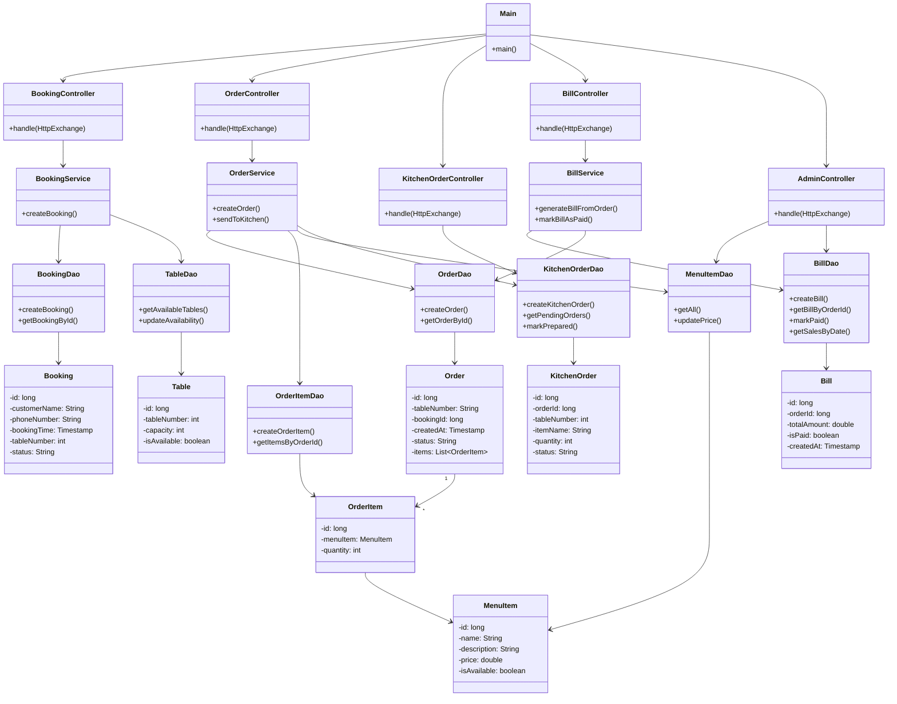
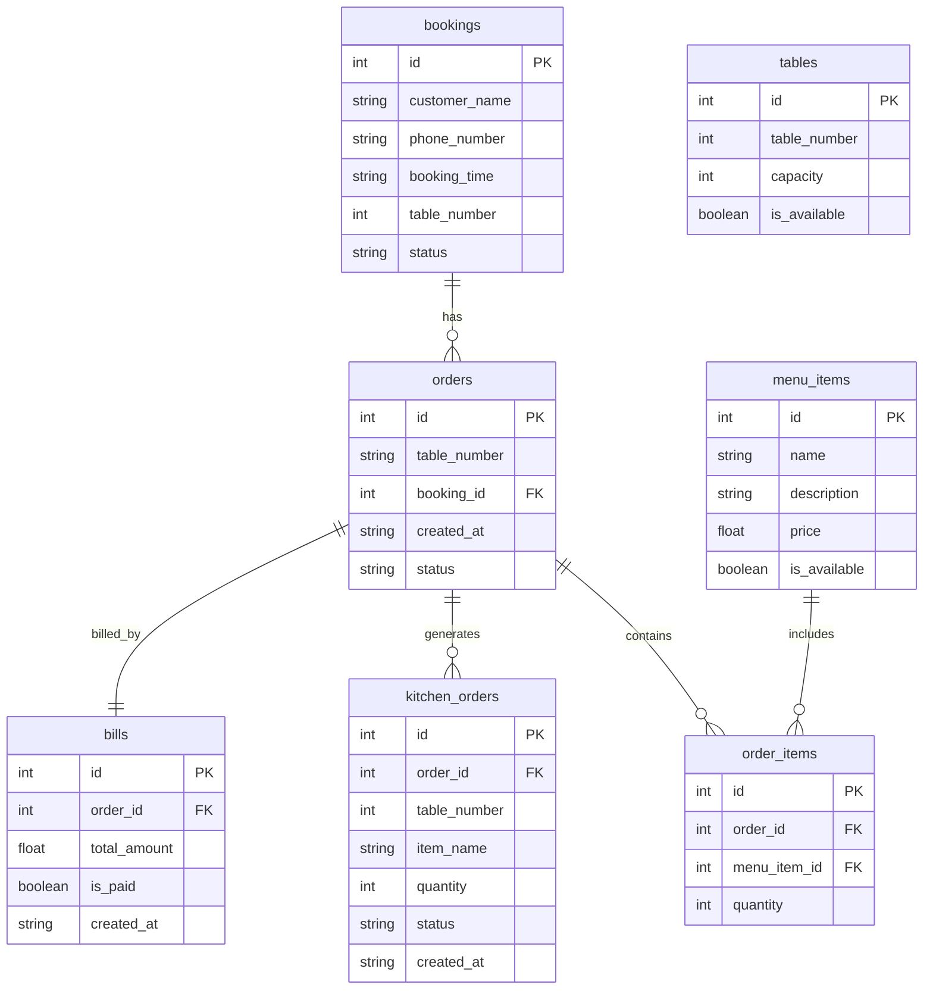
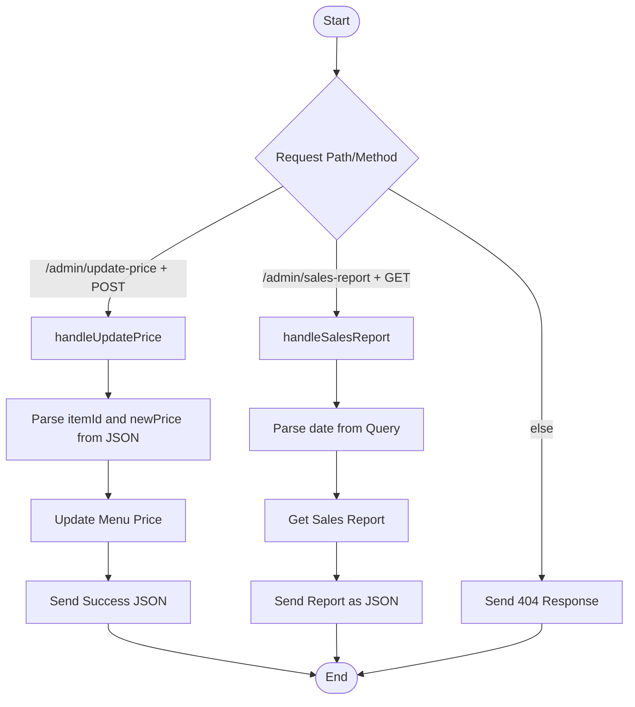
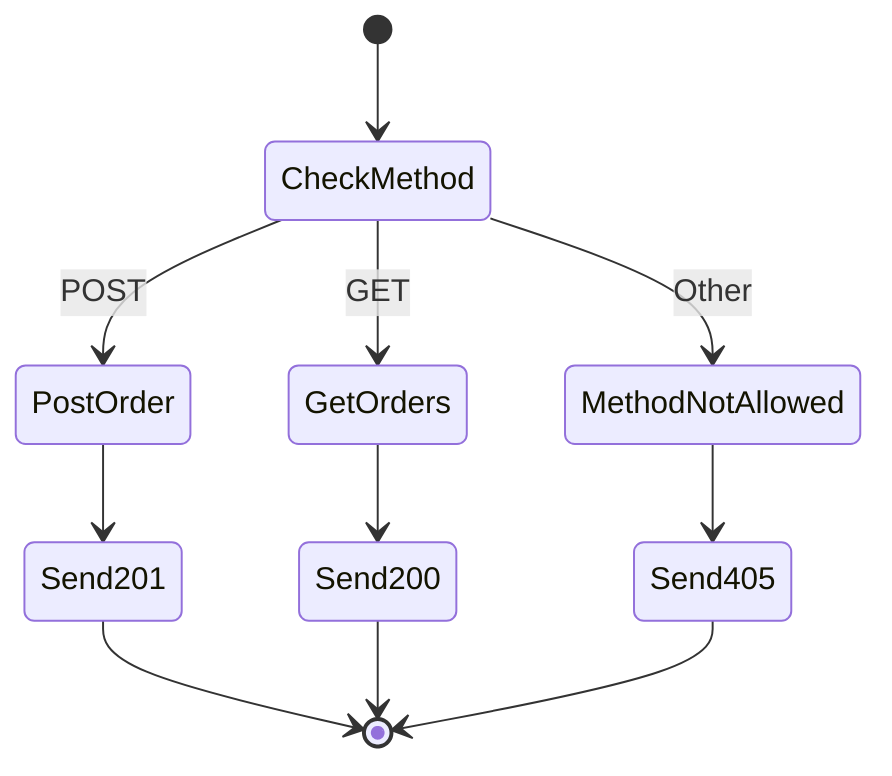

# Restaurant Management System

A Java-based Restaurant Management System built with `HttpServer` (from `com.sun.net.httpserver`) to expose RESTful APIs for managing bookings, orders, kitchen operations, billing, and admin functionalities. It follows a clean layered architecture with controllers, services, DAOs, DTOs, and models, and persists data in a relational SQL database via JDBC.

---

## Features

- **Table Booking:** Book tables, view bookings, and manage table availability.
- **Order Management:** Place orders, associate them with bookings/tables, and view all.
- **Kitchen Operations:** View live kitchen orders and mark them as prepared.
- **Billing:** Generate bills and mark them as paid.
- **Admin Panel:** Update menu item prices and generate daily sales reports.

---

## Tech Stack

- **Language:** Java
- **Framework:** Minimal setup using `HttpServer` (Spring Boot not used)
- **Database:** Relational SQL (via JDBC)
- **Build Tool:** Maven

---

## Project Structure

##  Project Structure

```plaintext
src/
├── controller/      → Handles HTTP requests (Booking, Order, Kitchen, etc.)
├── service/         → Business logic
├── dao/             → Data access logic (JDBC)
├── model/           → Domain models (Booking, Order, Bill, etc.)
├── dto/             → Data Transfer Objects (Requests & Responses)
└── util/            → Utility classes (JSON parsing, HTTP response helpers)

```


---

## API Endpoints

| Endpoint                        | Method | Description                        |
|----------------------------------|--------|------------------------------------|
| `/booking`                      | POST   | Book a table                       |
| `/booking`                      | GET    | List all bookings                  |
| `/order`                        | POST   | Place an order                     |
| `/order`                        | GET    | List all orders                    |
| `/kitchen/orders`               | GET    | Get live kitchen orders            |
| `/kitchen/orders/markPrepared`  | POST   | Mark kitchen order as prepared     |
| `/bill/generate`                | POST   | Generate bill for an order         |
| `/bill/pay`                     | POST   | Mark bill as paid                  |
| `/admin/update-price`           | POST   | Update menu item price             |
| `/admin/sales-report`           | GET    | Get daily sales report             |
| `/health`                       | GET    | Health check                       |

---

## 🧪 Getting Started

### 1. Clone the Repository
```sh
git clone https://github.com/yourusername/RestaurantManagement.git
```
```sh
cd RestaurantManagement
```
### 2. Configure Database
```sh
Edit application.properties with your database URL, username, and password.
```
### 3. Build the Project
```sh
mvn clean install
```
### 4. Run the Application
```sh
mvn exec:java -Dexec.mainClass="org.zeta.resturant.Main"
```
### 5. Access the API
The server runs by default at:
```sh
http://localhost:8080
```
Example Request
Book a Table
```sh
curl -X POST http://localhost:8080/booking \
  -H "Content-Type: application/json" \
  -d '{
    "customerName": "Alice",
    "phoneNumber": "1234567890",
    "tableNumber": 5
  }'
```

### Class Diagram 


### ER Diagram







## Results

## First Mini Project 

#


## Second Mini Project


